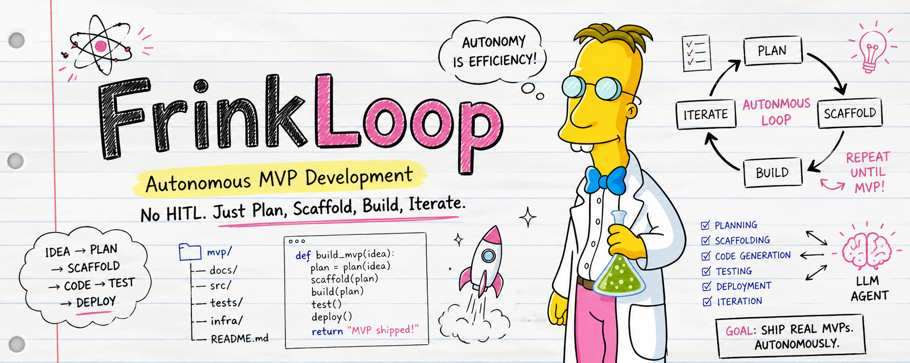

<p align="center">
  
</p>

<h1 align="center">FrinkLoop</h1>

<p align="center">
  <b>Autonomous MVP development for Claude Code.</b><br/>
  Plan → scaffold → build → verify → deliver. No HITL. Just ship MVPs.
</p>

<p align="center">
  <a href="https://github.com/fernandoleyra/FrinkLoop/stargazers"></a>
  <a href="LICENSE"></a>
  
  
</p>

---

You have an idea. **FrinkLoop ships it.**

A 4-question intake conversation becomes a deploy-ready MVP — code, README, landing page, screenshots, and a Phase-2 plan — fully autonomously, surviving Claude Code's 5-hour usage windows. No human in the loop after intake. Just plan, scaffold, build, iterate.

Per-project state lives inside each project's own `.frinkloop/` directory. The plugin itself stays at `~/.claude/plugins/frinkloop/`. Local-first. No SaaS in the middle.

## Install

In Claude Code, run two commands:

```
/plugin marketplace add fernandoleyra/FrinkLoop
/plugin install frinkloop@frinkloop
```

That's it. Type `/plugin list` to confirm.

## Quick start

```
/frinkloop new
```

## Commands

| Command | Purpose |
|---------|---------|
| `/frinkloop` | Router / help |
| `/frinkloop new` | Start intake chat → scaffold → build |
| `/frinkloop resume <project>` | Resume a paused or quota-stopped loop |
| `/frinkloop status [<project>]` | Snapshot of loop state |
| `/frinkloop pause <project>` | Flush state, write handoff, exit cleanly |
| `/frinkloop ds` | Design system manager (list / new / clone / push) |
| `/frinkloop deliver <project>` | Run the deliverable packaging step |

## What you get

- **Intake chat** — 4 short questions capture what you're building, who it's for, the stack, and the design system.
- **Scaffolder** — picks a starter template from a curated registry (Next.js, Vite + shadcn, Astroship, Hono, FastAPI, Citty, uvinit, Expo, WXT, Discord/Slack bots) and applies recipes.
- **Build loop** — Stop-hook spine that plans → builds → verifies → iterates against a target spec, with parallel subagent fan-out and worktree isolation for safe concurrency.
- **Design system store** — built-in `claude-default` preset, plus tokens-aware `new`/`clone`/`push` for cross-project reuse.
- **Local learning** — events log + rolled-up profile that pre-fills intake defaults from your past projects.
- **Quota-aware resume** — launchd/cron-scheduled wake-up after the 5-hour Claude Code window resets, so long builds finish on their own.
- **Deliverable packaging** — README rewrite, landing page, screenshot pipeline (Playwright), deploy step (Vercel/Netlify/Cloudflare via recipes), Phase-2 plan.

## Design principles

- **Autonomy is efficiency.** Once intake is done, FrinkLoop runs without you. Sit down to a built MVP.
- **Local-first.** All state under `~/.claude/plugins/frinkloop/` and `<project>/.frinkloop/` is local. No telemetry. No analytics. No backend.
- **Token-friendly.** Caveman-style compression on the loop spine; recipes are deterministic and idempotent so iteration costs stay low.
- **Honest about scope.** Phase-2 work (Stripe wiring, real auth, monitoring) is enumerated as a delivered artifact — not silently skipped.

## Architecture

This repo is the source of the **FrinkLoop Claude Code plugin**:

| Path | Purpose |
|------|---------|
| `plugin/` | The plugin payload — skills, commands, hooks, lib, templates, recipes. Installed at `~/.claude/plugins/frinkloop/`. |
| `tests/` | `bats` tests organized by plan number (`tests/plan-N/`). |
| `docs/superpowers/specs/` | Design specs. |
| `docs/superpowers/plans/` | Per-plan implementation plans + roadmap. |
| `.worktrees/` | Local git worktrees for parallel plan branches (gitignored). |

Per-user, per-project state goes inside the project itself in `.frinkloop/` — this repo never holds user projects.

## Develop and test

```bash
npm install              # bats + ajv-cli
npm test                 # runs bats -r tests/
```

## ⭐ Star this repo

If FrinkLoop helps you ship something, **please star the repo**. Stars are the single biggest signal that keeps this project alive and free for everyone.

[**→ Star FrinkLoop on GitHub**](https://github.com/fernandoleyra/FrinkLoop)

## Acknowledgements

FrinkLoop stands on the shoulders of:

- [**Ralph Loop**](https://ghuntley.com/ralph) by Geoffrey Huntley — the disk-state Stop-hook loop primitive.
- [**caveman**](https://github.com/JuliusBrussee/caveman) by Julius Brussee — token compression.
- [**obra/superpowers**](https://github.com/obra/superpowers) — TDD, verification, brainstorming, subagent patterns.
- [**Anthropic Claude Code**](https://github.com/anthropics/claude-code) — the platform that made plugins like this possible.
- **Y Combinator** — pitch frameworks for intake structure and communication.

If you build something on top of FrinkLoop, ping me — I'd love to see it.

## License

[MIT](LICENSE) © 2026 Fernando Leyra. Free to use, fork, modify, and redistribute.
